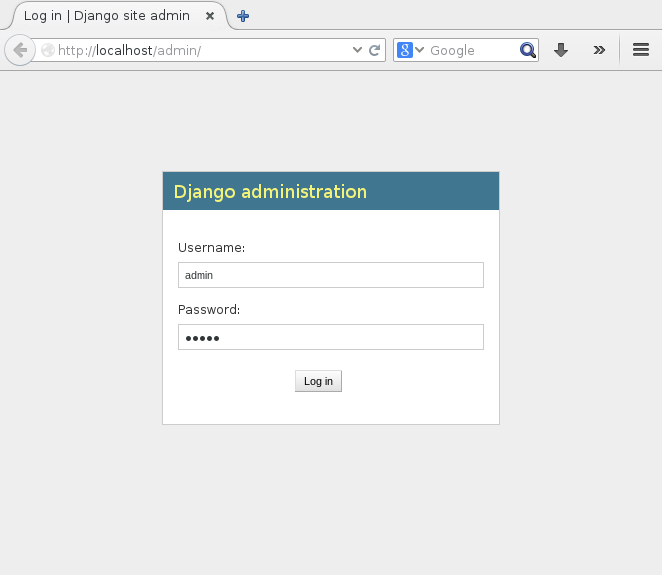
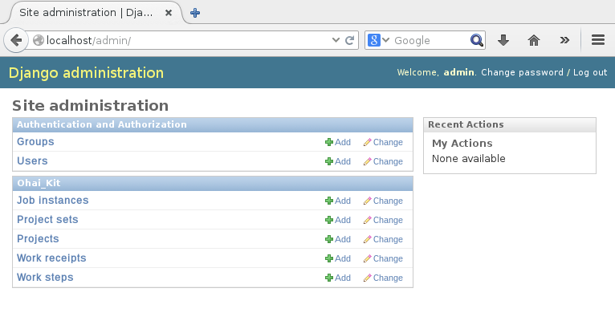
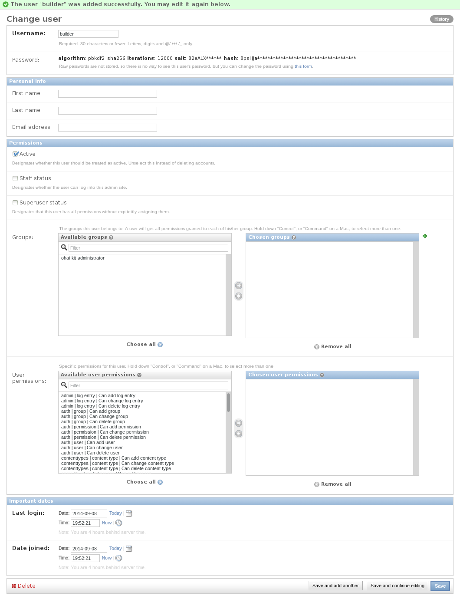

Open Hardware Assembly Instruction Kit
---

# Introduction
OHAI-KIT is a web application using the Django web framework.
It's a comprehensive, accessible source for putting together your newest piece of machinery. Aiming to create clear and concise instruction for optimal assembly, the OHAI-kit features step-by-step instructions, illustrative pictures, and thorough check-point to be sure all steps have been covered.

# Installation
## Requirements
OHAI-kit requires the following dependencies :

* Django >= 1.7
 * Python
* easy_thumbnails
* django-markdown-deux
* __*Optional*__ :  Apache
 * mod_wsgi

### Django
OHAI-kit depends on Django version 1.7 or latest. 
At the time of writing, the latest release candidate for 1.7 is 1.7c3.

Django will be automatically installed by ohai-kit's setup script, so it is not necessary to install it yourself. If you wish to install Django manually, keep reading.

You will first need to install Django, please refer to the [Django installation tutorial](https://docs.djangoproject.com/en/dev/topics/install/)

Make sure you have installed Python and PyPi (python-pip) from your distribution's package manager, then run :
`sudo pip install https://www.djangoproject.com/download/1.7c3/tarball/`

Once installed, run the command :

`python -c "import django; print(django.get_version())"`

And make sure that the django version is at least 1.7.

### easy_thumbnails
Easy_thumbnails will be automatically installed by ohai-kit's setup script. However, to manually install it, simply use the command :

`sudo pip install easy_thumbnails`

### django-markdown-deux
OHAI-kit requires the django-markdown-deux package installed.
The django-markdown-deux is a replacement for the previously deprecated django.contrib.markup package.
Django-markdown-deux will be automatically installed by ohai-kit's setup script. However, to manually install it, simply use the command :

`sudo pip install django-markdown-deux`

### Installing ohai-kit
To install ohai-kit and all its required dependencies, simply run :

`sudo python setup.py install`

The setup script will install ohai-kit then it will look for its dependency packages and install them.

# Configuring the Django project
OHAI-kit is a django application. You will first need to create a django project
in which to use the ohai_kit application. 

## Creating a project
Start by creating a django project with the command :

`django-admin startproject myproject`

Where 'myproject' can be any name you want to give the project.

## Setting up the project
Edit the **_myproject/settings.py_** file, and add to the *INSTALLED_APPS* variable, the *markdown_deux*, *easy_thumbnails* and *ohai_kit* apps, such that the variable looks like this :
```
  INSTALLED_APPS = (
      'django.contrib.admin',
      'django.contrib.auth',
      'django.contrib.contenttypes',
      'django.contrib.sessions',
      'django.contrib.messages',
      'django.contrib.staticfiles',
      'markdown_deux',
      'easy_thumbnails',
      'ohai_kit',
  )
```

## Configuring the database
You can also configure the database to use in the **_myproject/settings.py_** file. By default, the django project will use a sqllite3 database in the local file **db.sqlite3** in the project's base directory.
Refer to the [Django database documentation](https://docs.djangoproject.com/en/dev/ref/settings/#databases) for information on how to set-up your database.
You can either leave it as the default :
```
DATABASES = {
    'default': {
        'ENGINE': 'django.db.backends.sqlite3',
        'NAME': os.path.join(BASE_DIR, 'db.sqlite3'),
    }
}
```
Or set it up to use a PostgreSQL, Oracle or MySQL database for example :
```
DATABASES = {
    'default': {
        'ENGINE': 'django.db.backends.mysql',
        'NAME': 'mydatabase',
        'USER': 'mydatabaseuser',
        'PASSWORD': 'mypassword',
        'HOST': '127.0.0.1',
        'PORT': '5432',
    }
}
``` 

Once the database is configured, you must then create the database by running the command :

`python manage.py migrate`

If you update OHAI-kit or install other applications to your Django project or modify anything relating to the database, you must again call the migrate command.

## Configuring static file deployment
Your django settings will have a **STATIC_URL** option set by default to `/static/`. You can change that value to modify the URL for static file deployments.
You will also need to add the full absolute path where you will want to serve your static files on the server using the **STATIC_ROOT** variable.

For example :
```
STATIC_URL = '/static/'
STATIC_ROOT = '/var/www/myproject/static/'
```

## Configuring media uploads
In order to allow uploads of media to the ohai-kit server, you will need to configure a couple of additional options in **myproject/settings.py**. If you do not properly configure the media uploads, then you may not be able to upload pictures for your assembly instructions.

You will need to add the **MEDIA_URL** and **MEDIA_ROOT** variables to the _settings.py_ file where **MEDIA_URL** will be the URL of your media files and **MEDIA_ROOT** will be the _absolute path_ of your media directory.

For example :
```
MEDIA_URL = '/media/'
MEDIA_ROOT = '/var/www/myproject/media/'
```

## Configuring the URLs
You can now add a URL to the project that would resolve to the `ohai_kit` application by editing the **myproject/urls.py** file and adding a _url_ line to it.
Refer to the [Django URL functions](https://docs.djangoproject.com/en/dev/ref/urls/) for more information.

Please note however that Ohai-kit does not currently support being installed as a subdirectory such as '^ohai/'. You must set the URL for ohai-kit as the root directory of your website. This can be achieves by adding the following line to **myproject/urls.py** :

` url(r'^', include('ohai_kit.urls', namespace='ohai_kit')),`

You should end up with a **myproject/urls.py** containing something similar to this :
```
from django.conf.urls import patterns, include, url
from django.contrib import admin

urlpatterns = patterns('',
    url(r'^admin/', include(admin.site.urls)),
    url(r'^', include('ohai_kit.urls', namespace='ohai_kit')),
)
```


## Creating administrator user
Before you can start using Ohai-kit, you must first create the administrator user by running the following command :

`python manage.py createsuperuser`

Then follow the instructions on screen to create the administrator user for the application.

## Running OHAI-kit
Now that the django project is created and configured, you can test it by running the command : 

`python manage.py runserver`

This will run a local http server on port 8000 and print the address of the server, which will be by default **http://127.0.0.1:8000/**.
You can then enter that URL in your browser to test the server, and specify the URLs you used in **myproject/urls.py** to access the admin page or OHAI-kit.

You can run the server on any ip:port you want and use it on your production server. For more information on the available options, you can run :

`python manage.py help runserver`

Before using ohai-kit on a production server, make sure to set the **DEBUG** variable to *False* in the **settings.py** file.
It might be more secure however to use Apache on a production server.

# Configuring Apache
You can run OHAI-Kit from Apache using the *mod_wsgi* module. You can read the instructions for deploying Django projects using Apache and mod_wsgi from the relevent [Django documentation page](https://docs.djangoproject.com/en/dev/howto/deployment/wsgi/modwsgi/).
Remember however that Ohai-kit does not currently support being installed as part of an existing host under a subdirectory. You must install ohai-kit as its own virtual host configured to match the url `'^'`.

In order to integrate Ohai-kit with Apache, you will need the mod_wsgi module loaded and configured and to configure static file deployments and media file access.

The following instructions are for Apache 2.4 and later.
We recommend you create a ohai_kit.conf file in your /etc/httpd/conf.d/ directory.

For ohai-kit running as your main server's application, and your django project named 'myproject', your Apache ohai_kit.conf file would look like this :
```
Alias /static/ /var/www/myproject/static/
Alias /media/ /var/www/myproject/media/

<Directory /var/www/myproject/static>
Require all granted
</Directory>

<Directory /var/www/myproject/media>
Require all granted
</Directory>

WSGIScriptAlias / /var/www/myproject/myproject/wsgi.py
WSGIPythonPath /var/www/myproject

<Directory /var/www/myproject/myproject>
<Files wsgi.py>
Require all granted
</Files>
</Directory>
```

You will then need to create a **media** directory in your django project's base directory and copy the static files into the **static** directory using the **collectstatic** command.
```
mkdir /var/www/myproject/media
python manage.py collectstatic
```
The **collectstatic** command of the *manage.py* file will copy all the required static files in the appropriate directories according to your **STATIC_URL** and **STATIC_ROOT** variables defined in the *myproject/settings.py* file.

You must then make sure that the project directory has the proper permissions for access from Apache otherwise the database will be inaccessible.

```chown apache:apache -R /var/www/myproject```

If you are using ohai-kit on a production server, make sure to set the **DEBUG** variable to *False* in the **settings.py** file.

# Example installation for website ohai.com
Here is an example installation for installing ohai_kit on a website called ohai.com :
```
[root@alephobjects ~]# cd /var
[root@alephobjects var]# django-admin startproject ohai
[root@alephobjects var]# mv ohai/ ohai.com
[root@alephobjects var]# cd ohai.com/
[root@alephobjects ohai.com]# vi ohai/settings.py 
[root@alephobjects ohai.com]# grep -A 10 INSTALLED_APPS ohai/settings.py 
INSTALLED_APPS = (
    'django.contrib.admin',
    'django.contrib.auth',
    'django.contrib.contenttypes',
    'django.contrib.sessions',
    'django.contrib.messages',
    'django.contrib.staticfiles',
    'markdown_deux',
    'easy_thumbnails',
    'ohai_kit',
)
[root@alephobjects ohai.com]# grep -A 5 DATABASES ohai/settings.py 
DATABASES = {
    'default': {
        'ENGINE': 'django.db.backends.sqlite3',
        'NAME': os.path.join(BASE_DIR, 'db.sqlite3'),
    }
}
[root@alephobjects ohai.com]# grep -A 3 STATIC_URL ohai/settings.py 
STATIC_URL = '/static/'
STATIC_ROOT = '/var/ohai.com/static/'
MEDIA_URL = '/media/'
MEDIA_ROOT = '/var/ohai.com/media/'
[root@alephobjects ohai.com]# grep -B 1 DEBUG ohai/settings.py
# SECURITY WARNING: don't run with debug turned on in production!
DEBUG = False

TEMPLATE_DEBUG = True
[root@alephobjects ohai.com]# vi ohai/urls.py
[root@alephobjects ohai.com]# cat ohai/urls.py 
from django.conf.urls import patterns, include, url
from django.contrib import admin

urlpatterns = patterns('',
    # Examples:
    # url(r'^$', 'ohai.views.home', name='home'),
    # url(r'^blog/', include('blog.urls')),

    url(r'^admin/', include(admin.site.urls)),
    url(r'^', include('ohai_kit.urls', namespace='ohai_kit')),
)
[root@alephobjects ohai.com]# python manage.py migrate
Operations to perform:
  Synchronize unmigrated apps: ohai_kit
  Apply all migrations: admin, contenttypes, easy_thumbnails, auth, sessions
Synchronizing apps without migrations:
  Creating tables...
    Creating table ohai_kit_project
    Creating table ohai_kit_projectset_projects
    Creating table ohai_kit_projectset
    Creating table ohai_kit_workstep
    Creating table ohai_kit_steppicture
    Creating table ohai_kit_stepattachment
    Creating table ohai_kit_stepcheck
    Creating table ohai_kit_jobinstance
    Creating table ohai_kit_workreceipt
  Installing custom SQL...
  Installing indexes...
Running migrations:
  Applying contenttypes.0001_initial... OK
  Applying auth.0001_initial... OK
  Applying admin.0001_initial... OK
  Applying easy_thumbnails.0001_initial... OK
  Applying easy_thumbnails.0002_thumbnaildimensions... OK
  Applying easy_thumbnails.0003_auto_20140829_0112... OK
  Applying sessions.0001_initial... OK
[root@alephobjects ohai.com]# python manage.py createsuperuser
Username (leave blank to use 'root'): admin
Email address: admin@ohai.com
Password: 
Password (again): 
Superuser created successfully.
[root@alephobjects ohai.com]# python manage.py collectstatic
You have requested to collect static files at the destination
location as specified in your settings:

    /var/ohai.com/static

This will overwrite existing files!
Are you sure you want to do this?

Type 'yes' to continue, or 'no' to cancel: yes

[...]

93 static files copied to '/var/ohai.com/static'.
[root@alephobjects ohai.com]# mkdir media
[root@alephobjects ohai.com]# chown apache:apache -R /var/ohai.com/
[root@alephobjects ohai.com]# vi /etc/httpd/conf.d/ohai_kit.conf
[root@alephobjects ohai.com]# cat /etc/httpd/conf.d/ohai_kit.conf
Alias /static/ /var/ohai.com/static/
Alias /media/ /var/ohai.com/media/

<Directory /var/ohai.com/static>
Require all granted
</Directory>

<Directory /var/ohai.com/media>
Require all granted
</Directory>

WSGIScriptAlias / /var/ohai.com/ohai/wsgi.py
WSGIPythonPath /var/ohai.com/

<Directory /var/ohai.com/ohai>
<Files wsgi.py>
Require all granted
</Files>
</Directory>

[root@alephobjects ohai.com]# service httpd restart
Redirecting to /bin/systemctl restart  httpd.service
[root@alephobjects ohai.com]# 
```

Congratulations! Your ohai-kit server is now running!

# Configuring OHAI-Kit 

Ohai-kit can be configured using the **django.contrib.admin** application which should be installed by default under the *'^admin/'* URL.
You can point your browser to *http://mywebsite.com/admin/* and enter the administrator's username and password that you configured previously to get access to the Admin interface.



Once inside the Django administration interface, you can configure the various settings related to your ohai-kit installation, such as configuring groups and users, ohai-kit projects, project sets, work steps, job instances and work receipts.



## Editing authentication settings
The ohai-kit users are handled by the **django.contrib.auth** application which should be installed by default. It can be configured through the Admin interface under the **Authentication and Authorization** section.

### Adding a group
You can create new groups to assign specific permissions to the users within that group. Click on the **Add** button next to the **Groups** option in the admin interface in order to create a new group. You can then give a name to the group and assign permissions to it. The various permissions will sorted by application name (*ohai_kit*), configuration option (*project*) and permission (*Can add project*).


### Adding a user
You can create new users by clicking the **Add** button next to the **Users** option and assigning a username and password for the new user.


Once added, you can then change the user's settings, such as the name, email address and permissions.

To allow the user to login to the Administrator interface, you must enable the **Staff status** checkbox. This will only allow the user to login to the admin page, which will be empty. You will still need to assign specific permissions to the user to allow access to administrator's options.



You can assign individual permissions to the user, or add the user to a group with the appropriate permissions. Note that an ohai-kit worker does not require any permissions to function.

### Guest mode
In order to enable the automatic guest mode view of ohai-kit, you must edit the **myproject/settings.py** file in your django project's directory and add the following line :

`OHAIKIT_GUEST_ONLY= True`

This will disable the login screen from ohai-kit and will automatically log any visitors as guest.
If the option is enabled, then workers will be required to use the admin/ login page in order to login into their accounts. In that case, every user, including workers, will need the **Staff status** option enabled on their accounts in order to allow them to login through the administrator's page. Workers would still not require any additional permissions to function.

## Creating projects

## Creating Steps

## Creating Projectsets

## 
