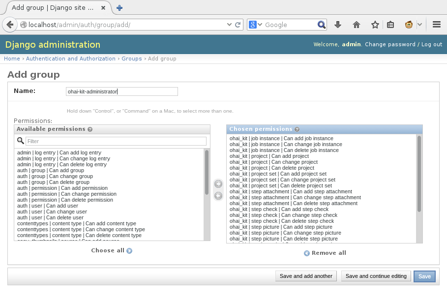

Open Hardware Assembly Instruction Kit
---
[« Back to README](../README.md)

# Ohai-kit Configuration
Ohai-kit can be configured using the **django.contrib.admin** application which should be installed by default under the *'^admin/'* URL.
You can point your browser to *http://mywebsite.com/admin/* and enter the administrator's username and password that you configured previously to get access to the Admin interface.

Once inside the Django administration interface, you can configure the various settings related to your ohai-kit installation, such as configuring groups and users, ohai-kit projects, project sets, work steps, job instances and work receipts.

## Editing authentication settings
The ohai-kit users are handled by the **django.contrib.auth** application which should be installed by default. It can be configured through the Admin interface under the **Authentication and Authorization** section.

### Adding a group
You can create new groups to assign specific permissions to the users within that group. Click on the **Add** button next to the **Groups** option in the admin interface in order to create a new group. You can then give a name to the group and assign permissions to it. The various permissions will sorted by application name (*ohai_kit*), configuration option (*project*) and permission (*Can add project*).

### Adding a user
You can create new users by clicking the **Add** button next to the **Users** option and assigning a username and password for the new user.

Once added, you can then change the user's settings, such as the name, email address and permissions.

To allow the user to login to the Administrator interface, you must enable the **Staff status** checkbox. This will only allow the user to login to the admin page, which will be empty. You will still need to assign specific permissions to the user to allow access to administrator's options.

You can assign individual permissions to the user, or add the user to a group with the appropriate permissions. Note that an ohai-kit worker does not require any permissions to function.

### Guest mode
In order to enable the automatic guest mode view of ohai-kit, you must edit the **myproject/settings.py** file in your django project's directory and add the following line :

`OHAIKIT_GUEST_ONLY= True`

This will disable the login screen from ohai-kit and will automatically log any visitors as guest.
If the option is enabled, then workers will be required to use the admin/ login page in order to login into their accounts. In that case, every user, including workers, will need the **Staff status** option enabled on their accounts in order to allow them to login through the administrator's page. Workers would still not require any additional permissions to function.

## Creating projects

## Creating Steps

## Creating Projectsets

## Misc ohai-kit options
